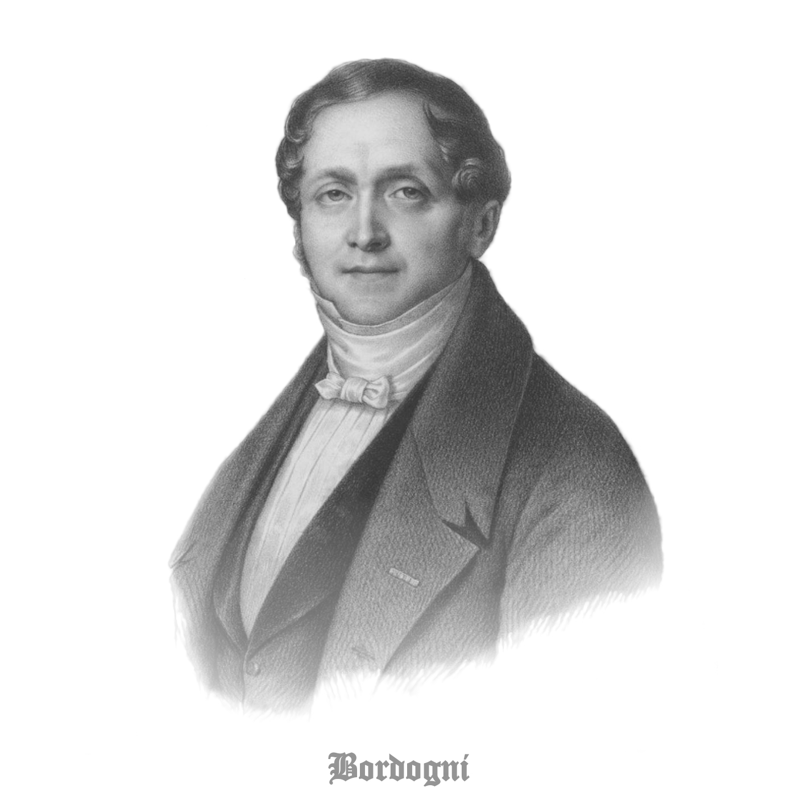

# Bordogni

## Vocalises

Composed for voice and piano by Giulio Marco Bordogni (commonly, Marco Bordogni) between 1840-1855, these vocalises are also known by trombonists as "Rochut" studies, after the ubiquitous editions of Melodious Etudes transcribed and arranged for trombone by Joannes Rochut in the 1920s. 

For these transcriptions, I have returned to original sources, in order to produce a digital set which can be freely distributed, unencumbered by copyright. In cases where Rochut transposed the original to a different key, I have included both keys. If you find mistakes, please let me know, so that I may correct and update the scores. Alternatively, pull requests are always welcome. 

## Formats

These [files](musescore) were transcribed into [musescore](https://musescore.org/) format. They are also available in my [public set](https://musescore.com/user/35220672/sets/5110656) on the musescore site. If you download the musescore files and open them locally in the [musescore software](https://musescore.org/en/download), you will be able to view the individual parts, transpose to different keys, clefs, etc, and generally edit them to suit your preferences. 

If you prefer to use the transcriptions as they are, the [PDF versions](PDF) of the parts should display nicely either in hardcopy or on digital tablet displays. For iOS devices, the [forScore](https://forscore.co/) application works very well for digital score management, but of course there are many other options to suit various use cases.

The [mp3s](mp3) are simple synth exports from musescore. The [full score](mp3/Full%20Score) versions are both trombone and piano parts together, which might be helpful for students approaching these vocalises for the first time, to get a sense of how the lines sound at tempo. The [accompaniment only](mp3/Accompaniment%20Only) versions are just piano, plus two (2) full measures of wood block intro. I haven't adjusted tempos, dynamics, ornaments, etc. for most of these, so they may sound a bit odd or mechanical in places. But, hopefully, they are helpful for sessions where you lack a live accompanist. If you do spend time tuning any of these for personal use, please consider a pull request that I can incorporate here so that everyone may benefit. 

## Reference Table

This table cross-maps the numbering and tempos from original sources to those used in Rochut's arrangements, with which many trombonists are more familiar. Links are included for the original source material, as well as for the transcribed sheet music and audio file artifacts. In cases where Rochut altered the original keys, the links in the table point to Rochut's transpositions. However, artifacts for both keys are available in each case. 

| Rochut # | Orig. # | Orig. Key | Rochut Key | Sheet Music**       | mp3***            | Tempo Base    | Orig. M.M. | Rochut M.M. | Yeo M.M. | Source Pages          | Orig.   Doc.        | Pub.  Date |
|--------------:|-------------:|:--------------:|:---------------:|:-------------------------|:------------------|:-------------------|----------------:|-----------------:|--------------:|:----------------------|:-------------------------|:---------------:| 
| \*     | 1     | C   | \*               | [T](PDF/Trombone/Bordogni_Vocalise-01_Trombone.pdf), [P](PDF/Piano/Bordogni_Vocalise-01_Piano.pdf), [S](PDF/Score/Bordogni_Vocalise-01_Score.pdf) | [S](mp3/Full%20Score/Bordogni_Vocalise-01_fullScore.mp3), [A](mp3/Accompaniment%20Only/Bordogni_Vocalise-01_Accompaniment.mp3)   | 1/4                 | 58               |                   | 60             | [01_p1.pdf](Sources/01-24_nouvelles_vocalises_à_la_portée_de_toutes_les_voix-11e_livre/01_p1.pdf)       | [1](Sources/01-24_nouvelles_vocalises_à_la_portée_de_toutes_les_voix-11e_livre/00-BnF_CompleteSource.pdf)                  | 1840      |
| 2      | 2     | F   |                  | [T](PDF/Trombone/Bordogni_Vocalise-02_Trombone.pdf), [P](PDF/Piano/Bordogni_Vocalise-02_Piano.pdf), [S](PDF/Score/Bordogni_Vocalise-02_Score.pdf) | [S](mp3/Full%20Score/Bordogni_Vocalise-02_fullScore.mp3), [A](mp3/Accompaniment%20Only/Bordogni_Vocalise-02_Accompaniment.mp3)   | 1/4                 | 84               | 90                | 94             | [02_pp2-3.pdf](Sources/01-24_nouvelles_vocalises_à_la_portée_de_toutes_les_voix-11e_livre/02_pp2-3.pdf)    | [1](Sources/01-24_nouvelles_vocalises_à_la_portée_de_toutes_les_voix-11e_livre/00-BnF_CompleteSource.pdf)                  | 1840      |
| 3      | 3     | G   |                  | [T](PDF/Trombone/Bordogni_Vocalise-03_Trombone.pdf), [P](PDF/Piano/Bordogni_Vocalise-03_Piano.pdf), [S](PDF/Score/Bordogni_Vocalise-03_Score.pdf) | [S](mp3/Full%20Score/Bordogni_Vocalise-03_fullScore.mp3), [A](mp3/Accompaniment%20Only/Bordogni_Vocalise-03_Accompaniment.mp3)   | 1/4                 | 92               | 104               | 92             | [03_pp4-5.pdf](Sources/01-24_nouvelles_vocalises_à_la_portée_de_toutes_les_voix-11e_livre/03_pp4-5.pdf)    | [1](Sources/01-24_nouvelles_vocalises_à_la_portée_de_toutes_les_voix-11e_livre/00-BnF_CompleteSource.pdf)                  | 1840      |
| 4      | 4     | F   |                  | [T](PDF/Trombone/Bordogni_Vocalise-04_Trombone.pdf), [P](PDF/Piano/Bordogni_Vocalise-04_Piano.pdf), [S](PDF/Score/Bordogni_Vocalise-04_Score.pdf) | [S](mp3/Full%20Score/Bordogni_Vocalise-04_fullScore.mp3), [A](mp3/Accompaniment%20Only/Bordogni_Vocalise-04_Accompaniment.mp3)   | 1/4                 | 63               | 69                | 78             | [04_pp6-7.pdf](Sources/01-24_nouvelles_vocalises_à_la_portée_de_toutes_les_voix-11e_livre/04_pp6-7.pdf)    | [1](Sources/01-24_nouvelles_vocalises_à_la_portée_de_toutes_les_voix-11e_livre/00-BnF_CompleteSource.pdf)                  | 1840      |
| 5      | 5     | C   |                  | [T](PDF/Trombone/Bordogni_Vocalise-05_Trombone.pdf), [P](PDF/Piano/Bordogni_Vocalise-05_Piano.pdf), [S](PDF/Score/Bordogni_Vocalise-05_Score.pdf) | [S](mp3/Full%20Score/Bordogni_Vocalise-05_fullScore.mp3), [A](mp3/Accompaniment%20Only/Bordogni_Vocalise-05_Accompaniment.mp3)   | 1/4                 | 96               | 96                | 104            | [05_pp8-9.pdf](Sources/01-24_nouvelles_vocalises_à_la_portée_de_toutes_les_voix-11e_livre/05_pp8-9.pdf)    | [1](Sources/01-24_nouvelles_vocalises_à_la_portée_de_toutes_les_voix-11e_livre/00-BnF_CompleteSource.pdf)                  | 1840      |
| 6      | 6     | Eb  |                  | [T](PDF/Trombone/Bordogni_Vocalise-06_Trombone.pdf), [P](PDF/Piano/Bordogni_Vocalise-06_Piano.pdf), [S](PDF/Score/Bordogni_Vocalise-06_Score.pdf) | [S](mp3/Full%20Score/Bordogni_Vocalise-06_fullScore.mp3), [A](mp3/Accompaniment%20Only/Bordogni_Vocalise-06_Accompaniment.mp3)   | 1/4                 | 60               | 60                | 78             | [06_pp10-11.pdf](Sources/01-24_nouvelles_vocalises_à_la_portée_de_toutes_les_voix-11e_livre/06_pp10-11.pdf)  | [1](Sources/01-24_nouvelles_vocalises_à_la_portée_de_toutes_les_voix-11e_livre/00-BnF_CompleteSource.pdf)                  | 1840      |
| 7      | 7     | Bb  |                  | [T](PDF/Trombone/Bordogni_Vocalise-07_Trombone.pdf), [P](PDF/Piano/Bordogni_Vocalise-07_Piano.pdf), [S](PDF/Score/Bordogni_Vocalise-07_Score.pdf) | [S](mp3/Full%20Score/Bordogni_Vocalise-07_fullScore.mp3), [A](mp3/Accompaniment%20Only/Bordogni_Vocalise-07_Accompaniment.mp3)   | 1/4.                | 100              | 100               | 100            | [07_pp12-14.pdf](Sources/01-24_nouvelles_vocalises_à_la_portée_de_toutes_les_voix-11e_livre/07_pp12-14.pdf)  | [1](Sources/01-24_nouvelles_vocalises_à_la_portée_de_toutes_les_voix-11e_livre/00-BnF_CompleteSource.pdf)                  | 1840      |
| 8      | 8     | D   |                  | [T](PDF/Trombone/Bordogni_Vocalise-08_Trombone.pdf), [P](PDF/Piano/Bordogni_Vocalise-08_Piano.pdf), [S](PDF/Score/Bordogni_Vocalise-08_Score.pdf) | [S](mp3/Full%20Score/Bordogni_Vocalise-08_fullScore.mp3), [A](mp3/Accompaniment%20Only/Bordogni_Vocalise-08_Accompaniment.mp3)   | 1/8                 | 66               | 86                | 90             | [08_p15.pdf](Sources/01-24_nouvelles_vocalises_à_la_portée_de_toutes_les_voix-11e_livre/08_p15.pdf)      | [1](Sources/01-24_nouvelles_vocalises_à_la_portée_de_toutes_les_voix-11e_livre/00-BnF_CompleteSource.pdf)                  | 1840      |
| 9      | 9     | C   |                  | [T](PDF/Trombone/Bordogni_Vocalise-09_Trombone.pdf), [P](PDF/Piano/Bordogni_Vocalise-09_Piano.pdf), [S](PDF/Score/Bordogni_Vocalise-09_Score.pdf) | [S](mp3/Full%20Score/Bordogni_Vocalise-09_fullScore.mp3), [A](mp3/Accompaniment%20Only/Bordogni_Vocalise-09_Accompaniment.mp3)   | 1/4.                | 76               | 75                | 76             | [09_pp16-17.pdf](Sources/01-24_nouvelles_vocalises_à_la_portée_de_toutes_les_voix-11e_livre/09_pp16-17.pdf)  | [1](Sources/01-24_nouvelles_vocalises_à_la_portée_de_toutes_les_voix-11e_livre/00-BnF_CompleteSource.pdf)                  | 1840      |
| 10     | 10    | g/G |                  | [T](PDF/Trombone/Bordogni_Vocalise-10_Trombone.pdf), [P](PDF/Piano/Bordogni_Vocalise-10_Piano.pdf), [S](PDF/Score/Bordogni_Vocalise-10_Score.pdf) | [S](mp3/Full%20Score/Bordogni_Vocalise-10_fullScore.mp3), [A](mp3/Accompaniment%20Only/Bordogni_Vocalise-10_Accompaniment.mp3)   | 1/4.                | 46               | 60                | 46             | [10_pp18-19.pdf](Sources/01-24_nouvelles_vocalises_à_la_portée_de_toutes_les_voix-11e_livre/10_pp18-19.pdf)  | [1](Sources/01-24_nouvelles_vocalises_à_la_portée_de_toutes_les_voix-11e_livre/00-BnF_CompleteSource.pdf)                  | 1840      |
| 11     | 11    | F   |                  | [T](PDF/Trombone/Bordogni_Vocalise-11_Trombone.pdf), [P](PDF/Piano/Bordogni_Vocalise-11_Piano.pdf), [S](PDF/Score/Bordogni_Vocalise-11_Score.pdf) | [S](mp3/Full%20Score/Bordogni_Vocalise-11_fullScore.mp3), [A](mp3/Accompaniment%20Only/Bordogni_Vocalise-11_Accompaniment.mp3)   | 1/4.                | 126              | 126               | 126            | [11_pp20-21.pdf](Sources/01-24_nouvelles_vocalises_à_la_portée_de_toutes_les_voix-11e_livre/11_pp20-21.pdf)  | [1](Sources/01-24_nouvelles_vocalises_à_la_portée_de_toutes_les_voix-11e_livre/00-BnF_CompleteSource.pdf)                  | 1840      |
| 12     | 12    | Db  |                  | [T](PDF/Trombone/Bordogni_Vocalise-12_Trombone.pdf), [P](PDF/Piano/Bordogni_Vocalise-12_Piano.pdf), [S](PDF/Score/Bordogni_Vocalise-12_Score.pdf) | [S](mp3/Full%20Score/Bordogni_Vocalise-12_fullScore.mp3), [A](mp3/Accompaniment%20Only/Bordogni_Vocalise-12_Accompaniment.mp3)   | 1/8                 | 66               | 120               | 66             | [12_pp22-23.pdf](Sources/01-24_nouvelles_vocalises_à_la_portée_de_toutes_les_voix-11e_livre/12_pp22-23.pdf)  | [1](Sources/01-24_nouvelles_vocalises_à_la_portée_de_toutes_les_voix-11e_livre/00-BnF_CompleteSource.pdf)                  | 1840      |
| 13     | 15    | Eb  |                  | [T](PDF/Trombone/Bordogni_Vocalise-13_Trombone.pdf), [P](PDF/Piano/Bordogni_Vocalise-13_Piano.pdf), [S](PDF/Score/Bordogni_Vocalise-13_Score.pdf) | [S](mp3/Full%20Score/Bordogni_Vocalise-13_fullScore.mp3), [A](mp3/Accompaniment%20Only/Bordogni_Vocalise-13_Accompaniment.mp3)   | 1/8                 | 72               | 72                | 98             | [15_pp30-31.pdf](Sources/01-24_nouvelles_vocalises_à_la_portée_de_toutes_les_voix-11e_livre/15_pp30-31.pdf)  | [1](Sources/01-24_nouvelles_vocalises_à_la_portée_de_toutes_les_voix-11e_livre/00-BnF_CompleteSource.pdf)                  | 1840      |
| 14     | 13    | Bb  | B                | [T](PDF/Trombone/Bordogni_Vocalise-14_Rochut_Trombone.pdf), [P](PDF/Piano/Bordogni_Vocalise-14_Rochut_Piano.pdf), [S](PDF/Score/Bordogni_Vocalise-14_Rochut_Score.pdf) | [S](mp3/Full%20Score/Bordogni_Vocalise-14_Rochut_fullScore.mp3), [A](mp3/Accompaniment%20Only/Bordogni_Vocalise-14_Rochut_Accompaniment.mp3)   | 1/4                 | 72               | 72                | 72             | [13_pp24-26.pdf](Sources/01-24_nouvelles_vocalises_à_la_portée_de_toutes_les_voix-11e_livre/13_pp24-26.pdf)  | [1](Sources/01-24_nouvelles_vocalises_à_la_portée_de_toutes_les_voix-11e_livre/00-BnF_CompleteSource.pdf)                  | 1840      |
| 15     | 2     | Eb  |                  | [T](PDF/Trombone/Bordogni_Vocalise-15_Trombone.pdf), [P](PDF/Piano/Bordogni_Vocalise-15_Piano.pdf), [S](PDF/Score/Bordogni_Vocalise-15_Score.pdf) | [S](mp3/Full%20Score/Bordogni_Vocalise-15_fullScore.mp3), [A](mp3/Accompaniment%20Only/Bordogni_Vocalise-15_Accompaniment.mp3)   | 1/4                 | 84               | 104               | 124            | [02_pp4-6.pdf](Sources/02-24_nouvelles_vocalises_pour_mezzo-soprano_ou_contralto-12e_livre/02_pp4-6.pdf)    | [2](Sources/02-24_nouvelles_vocalises_pour_mezzo-soprano_ou_contralto-12e_livre/00-BnF_CompleteSource.pdf)                  | 1855      |
| 16     | 21    | Ab  |                  | [T](PDF/Trombone/Bordogni_Vocalise-16_Trombone.pdf), [P](PDF/Piano/Bordogni_Vocalise-16_Piano.pdf), [S](PDF/Score/Bordogni_Vocalise-16_Score.pdf) | [S](mp3/Full%20Score/Bordogni_Vocalise-16_fullScore.mp3), [A](mp3/Accompaniment%20Only/Bordogni_Vocalise-16_Accompaniment.mp3)   | 1/2.                | 66               | 40                | 40             | [21_pp44-45.pdf](Sources/01-24_nouvelles_vocalises_à_la_portée_de_toutes_les_voix-11e_livre/21_pp44-45.pdf)  | [1](Sources/01-24_nouvelles_vocalises_à_la_portée_de_toutes_les_voix-11e_livre/00-BnF_CompleteSource.pdf)                  | 1840      |
| 17     | 14    | G   |                  | [T](PDF/Trombone/Bordogni_Vocalise-17_Trombone.pdf), [P](PDF/Piano/Bordogni_Vocalise-17_Piano.pdf), [S](PDF/Score/Bordogni_Vocalise-17_Score.pdf) | [S](mp3/Full%20Score/Bordogni_Vocalise-17_fullScore.mp3), [A](mp3/Accompaniment%20Only/Bordogni_Vocalise-17_Accompaniment.mp3)   | 1/4                 | 108              | 120               | 108            | [14_pp27-29.pdf](Sources/01-24_nouvelles_vocalises_à_la_portée_de_toutes_les_voix-11e_livre/14_pp27-29.pdf)  | [1](Sources/01-24_nouvelles_vocalises_à_la_portée_de_toutes_les_voix-11e_livre/00-BnF_CompleteSource.pdf)                  | 1840      |
| 18     | 16    | Ab  | A                | [T](PDF/Trombone/Bordogni_Vocalise-18_Rochut_Trombone.pdf), [P](PDF/Piano/Bordogni_Vocalise-18_Rochut_Piano.pdf), [S](PDF/Score/Bordogni_Vocalise-18_Rochut_Score.pdf) | [S](mp3/Full%20Score/Bordogni_Vocalise-18_Rochut_fullScore.mp3), [A](mp3/Accompaniment%20Only/Bordogni_Vocalise-18_Rochut_Accompaniment.mp3)   | 1/4                 | 132              | 132               | 132            | [16_pp32-35.pdf](Sources/01-24_nouvelles_vocalises_à_la_portée_de_toutes_les_voix-11e_livre/16_pp32-35.pdf)  | [1](Sources/01-24_nouvelles_vocalises_à_la_portée_de_toutes_les_voix-11e_livre/00-BnF_CompleteSource.pdf)                  | 1840      |
| 19     | 18    | Db  |                  | [T](PDF/Trombone/Bordogni_Vocalise-19_Trombone.pdf), [P](PDF/Piano/Bordogni_Vocalise-19_Piano.pdf), [S](PDF/Score/Bordogni_Vocalise-19_Score.pdf) | [S](mp3/Full%20Score/Bordogni_Vocalise-19_fullScore.mp3), [A](mp3/Accompaniment%20Only/Bordogni_Vocalise-19_Accompaniment.mp3)   | 1/4                 | 92               | 72                | 92             | [18_pp38-39.pdf](Sources/01-24_nouvelles_vocalises_à_la_portée_de_toutes_les_voix-11e_livre/18_pp38-39.pdf)  | [1](Sources/01-24_nouvelles_vocalises_à_la_portée_de_toutes_les_voix-11e_livre/00-BnF_CompleteSource.pdf)                  | 1840      |
| 20     | 20    | Eb  | E                | [T](PDF/Trombone/Bordogni_Vocalise-20_Rochut_Trombone.pdf), [P](PDF/Piano/Bordogni_Vocalise-20_Rochut_Piano.pdf), [S](PDF/Score/Bordogni_Vocalise-20_Rochut_Score.pdf) | [S](mp3/Full%20Score/Bordogni_Vocalise-20_Rochut_fullScore.mp3), [A](mp3/Accompaniment%20Only/Bordogni_Vocalise-20_Rochut_Accompaniment.mp3)   | 1/4.                | 48               | 48                | 48             | [20_pp42-43.pdf](Sources/01-24_nouvelles_vocalises_à_la_portée_de_toutes_les_voix-11e_livre/20_pp42-43.pdf)  | [1](Sources/01-24_nouvelles_vocalises_à_la_portée_de_toutes_les_voix-11e_livre/00-BnF_CompleteSource.pdf)                  | 1840      |
| 21     | 17    | F   |                  | [T](PDF/Trombone/Bordogni_Vocalise-21_Trombone.pdf), [P](PDF/Piano/Bordogni_Vocalise-21_Piano.pdf), [S](PDF/Score/Bordogni_Vocalise-21_Score.pdf) | [S](mp3/Full%20Score/Bordogni_Vocalise-21_fullScore.mp3), [A](mp3/Accompaniment%20Only/Bordogni_Vocalise-21_Accompaniment.mp3)   | 1/4                 | 92               | 92                | 92             | [17_pp36-37.pdf](Sources/01-24_nouvelles_vocalises_à_la_portée_de_toutes_les_voix-11e_livre/17_pp36-37.pdf)  | [1](Sources/01-24_nouvelles_vocalises_à_la_portée_de_toutes_les_voix-11e_livre/00-BnF_CompleteSource.pdf)                  | 1840      |
| 22     | 19    | D   |                  | [T](PDF/Trombone/Bordogni_Vocalise-22_Trombone.pdf), [P](PDF/Piano/Bordogni_Vocalise-22_Piano.pdf), [S](PDF/Score/Bordogni_Vocalise-22_Score.pdf) | [S](mp3/Full%20Score/Bordogni_Vocalise-22_fullScore.mp3), [A](mp3/Accompaniment%20Only/Bordogni_Vocalise-22_Accompaniment.mp3)   | 1/4                 | 96               | 112               | 108            | [19_pp40-41.pdf](Sources/01-24_nouvelles_vocalises_à_la_portée_de_toutes_les_voix-11e_livre/19_pp40-41.pdf)  | [1](Sources/01-24_nouvelles_vocalises_à_la_portée_de_toutes_les_voix-11e_livre/00-BnF_CompleteSource.pdf)                  | 1840      |
| 23     | 22    | Ab  |                  | [T](PDF/Trombone/Bordogni_Vocalise-23_Trombone.pdf), [P](PDF/Piano/Bordogni_Vocalise-23_Piano.pdf), [S](PDF/Score/Bordogni_Vocalise-23_Score.pdf) | [S](mp3/Full%20Score/Bordogni_Vocalise-23_fullScore.mp3), [A](mp3/Accompaniment%20Only/Bordogni_Vocalise-23_Accompaniment.mp3)   | 1/8                 | 58               | 58                | 72             | [22_pp46-47.pdf](Sources/01-24_nouvelles_vocalises_à_la_portée_de_toutes_les_voix-11e_livre/22_pp46-47.pdf)  | [1](Sources/01-24_nouvelles_vocalises_à_la_portée_de_toutes_les_voix-11e_livre/00-BnF_CompleteSource.pdf)                  | 1840      |
| 24     | 24    | a   |                  | [T](PDF/Trombone/Bordogni_Vocalise-24_Trombone.pdf), [P](PDF/Piano/Bordogni_Vocalise-24_Piano.pdf), [S](PDF/Score/Bordogni_Vocalise-24_Score.pdf) | [S](mp3/Full%20Score/Bordogni_Vocalise-24_fullScore.mp3), [A](mp3/Accompaniment%20Only/Bordogni_Vocalise-24_Accompaniment.mp3)   | 1/2                 | 120              | 120               | 100            | [24_pp50-51.pdf](Sources/01-24_nouvelles_vocalises_à_la_portée_de_toutes_les_voix-11e_livre/24_pp50-51.pdf)  | [1](Sources/01-24_nouvelles_vocalises_à_la_portée_de_toutes_les_voix-11e_livre/00-BnF_CompleteSource.pdf)                  | 1840      |
| 25     | 23    | A   |                  | [T](PDF/Trombone/Bordogni_Vocalise-25_Trombone.pdf), [P](PDF/Piano/Bordogni_Vocalise-25_Piano.pdf), [S](PDF/Score/Bordogni_Vocalise-25_Score.pdf) | [S](mp3/Full%20Score/Bordogni_Vocalise-25_fullScore.mp3), [A](mp3/Accompaniment%20Only/Bordogni_Vocalise-25_Accompaniment.mp3)   | 1/4                 | 112              | 112               | 98             | [23_pp48-49.pdf](Sources/01-24_nouvelles_vocalises_à_la_portée_de_toutes_les_voix-11e_livre/23_pp48-49.pdf)  | [1](Sources/01-24_nouvelles_vocalises_à_la_portée_de_toutes_les_voix-11e_livre/00-BnF_CompleteSource.pdf)                  | 1840      |
| 26     | 3     | F   |                  | [T](PDF/Trombone/Bordogni_Vocalise-26_Trombone.pdf), [P](PDF/Piano/Bordogni_Vocalise-26_Piano.pdf), [S](PDF/Score/Bordogni_Vocalise-26_Score.pdf) | [S](mp3/Full%20Score/Bordogni_Vocalise-26_fullScore.mp3), [A](mp3/Accompaniment%20Only/Bordogni_Vocalise-26_Accompaniment.mp3)   | 1/2                 | 56               | 56                | 62             | [03_pp7-9.pdf](Sources/02-24_nouvelles_vocalises_pour_mezzo-soprano_ou_contralto-12e_livre/03_pp7-9.pdf)    | [2](Sources/02-24_nouvelles_vocalises_pour_mezzo-soprano_ou_contralto-12e_livre/00-BnF_CompleteSource.pdf)                  | 1855      |
| 27     | 4     | D   | E                | [T](PDF/Trombone/Bordogni_Vocalise-27_Rochut_Trombone.pdf), [P](PDF/Piano/Bordogni_Vocalise-27_Rochut_Piano.pdf), [S](PDF/Score/Bordogni_Vocalise-27_Rochut_Score.pdf) | [S](mp3/Full%20Score/Bordogni_Vocalise-27_Rochut_fullScore.mp3), [A](mp3/Accompaniment%20Only/Bordogni_Vocalise-27_Rochut_Accompaniment.mp3)   | 1/4.                | 76               | 40                | 40             | [04_pp10-11.pdf](Sources/02-24_nouvelles_vocalises_pour_mezzo-soprano_ou_contralto-12e_livre/04_pp10-11.pdf)  | [2](Sources/02-24_nouvelles_vocalises_pour_mezzo-soprano_ou_contralto-12e_livre/00-BnF_CompleteSource.pdf)                  | 1855      |
| 28     | 5     | D   | E                | [T](PDF/Trombone/Bordogni_Vocalise-28_Rochut_Trombone.pdf), [P](PDF/Piano/Bordogni_Vocalise-28_Rochut_Piano.pdf), [S](PDF/Score/Bordogni_Vocalise-28_Rochut_Score.pdf) | [S](mp3/Full%20Score/Bordogni_Vocalise-28_Rochut_fullScore.mp3), [A](mp3/Accompaniment%20Only/Bordogni_Vocalise-28_Rochut_Accompaniment.mp3)   | 1/2                 | 69               | 64                | 54             | [05_pp12-14.pdf](Sources/02-24_nouvelles_vocalises_pour_mezzo-soprano_ou_contralto-12e_livre/05_pp12-14.pdf)  | [2](Sources/02-24_nouvelles_vocalises_pour_mezzo-soprano_ou_contralto-12e_livre/00-BnF_CompleteSource.pdf)                  | 1855      |
| 29     | 7     | Ab  |                  | [T](PDF/Trombone/Bordogni_Vocalise-29_Trombone.pdf), [P](PDF/Piano/Bordogni_Vocalise-29_Piano.pdf), [S](PDF/Score/Bordogni_Vocalise-29_Score.pdf) | [S](mp3/Full%20Score/Bordogni_Vocalise-29_fullScore.mp3), [A](mp3/Accompaniment%20Only/Bordogni_Vocalise-29_Accompaniment.mp3)   | 1/4.                | 80               | 32                | 32             | [07_pp17-19.pdf](Sources/02-24_nouvelles_vocalises_pour_mezzo-soprano_ou_contralto-12e_livre/07_pp17-19.pdf)  | [2](Sources/02-24_nouvelles_vocalises_pour_mezzo-soprano_ou_contralto-12e_livre/00-BnF_CompleteSource.pdf)                  | 1855      |
| 30     | 1     | C   | D                | [T](PDF/Trombone/Bordogni_Vocalise-30_Rochut_Trombone.pdf), [P](PDF/Piano/Bordogni_Vocalise-30_Rochut_Piano.pdf), [S](PDF/Score/Bordogni_Vocalise-30_Rochut_Score.pdf) | [S](mp3/Full%20Score/Bordogni_Vocalise-30_Rochut_fullScore.mp3), [A](mp3/Accompaniment%20Only/Bordogni_Vocalise-30_Rochut_Accompaniment.mp3)   | 1/2                 | 40               | 46                | 42             | [01_pp2-3.pdf](Sources/02-24_nouvelles_vocalises_pour_mezzo-soprano_ou_contralto-12e_livre/01_pp2-3.pdf)    | [2](Sources/02-24_nouvelles_vocalises_pour_mezzo-soprano_ou_contralto-12e_livre/00-BnF_CompleteSource.pdf)                  | 1855      |
| 31     | 6     | Eb  |                  | [T](PDF/Trombone/Bordogni_Vocalise-31_Trombone.pdf), [P](PDF/Piano/Bordogni_Vocalise-31_Piano.pdf), [S](PDF/Score/Bordogni_Vocalise-31_Score.pdf) | [S](mp3/Full%20Score/Bordogni_Vocalise-31_fullScore.mp3), [A](mp3/Accompaniment%20Only/Bordogni_Vocalise-31_Accompaniment.mp3)   | 1/4.                | 54               | 18                | 54             | [06_pp15-16.pdf](Sources/02-24_nouvelles_vocalises_pour_mezzo-soprano_ou_contralto-12e_livre/06_pp15-16.pdf)  | [2](Sources/02-24_nouvelles_vocalises_pour_mezzo-soprano_ou_contralto-12e_livre/00-BnF_CompleteSource.pdf)                  | 1855      |
| 32     | 9     | G   |                  | [T](PDF/Trombone/Bordogni_Vocalise-32_Trombone.pdf), [P](PDF/Piano/Bordogni_Vocalise-32_Piano.pdf), [S](PDF/Score/Bordogni_Vocalise-32_Score.pdf) | [S](mp3/Full%20Score/Bordogni_Vocalise-32_fullScore.mp3), [A](mp3/Accompaniment%20Only/Bordogni_Vocalise-32_Accompaniment.mp3)   | 1/2                 | 76               | 60                | 60             | [09_pp23-24.pdf](Sources/02-24_nouvelles_vocalises_pour_mezzo-soprano_ou_contralto-12e_livre/09_pp23-24.pdf)  | [2](Sources/02-24_nouvelles_vocalises_pour_mezzo-soprano_ou_contralto-12e_livre/00-BnF_CompleteSource.pdf)                  | 1855      |
| 33     | 8     | G   | A                | [T](PDF/Trombone/Bordogni_Vocalise-33_Rochut_Trombone.pdf), [P](PDF/Piano/Bordogni_Vocalise-33_Rochut_Piano.pdf), [S](PDF/Score/Bordogni_Vocalise-33_Rochut_Score.pdf) | [S](mp3/Full%20Score/Bordogni_Vocalise-33_Rochut_fullScore.mp3), [A](mp3/Accompaniment%20Only/Bordogni_Vocalise-33_Rochut_Accompaniment.mp3)   | 1/4                 | 60               | 60                | 60             | [08_pp20-22.pdf](Sources/02-24_nouvelles_vocalises_pour_mezzo-soprano_ou_contralto-12e_livre/08_pp20-22.pdf)  | [2](Sources/02-24_nouvelles_vocalises_pour_mezzo-soprano_ou_contralto-12e_livre/00-BnF_CompleteSource.pdf)                  | 1855      |
| 34     | 10    | e/E |                  | [T](PDF/Trombone/Bordogni_Vocalise-34_Trombone.pdf), [P](PDF/Piano/Bordogni_Vocalise-34_Piano.pdf), [S](PDF/Score/Bordogni_Vocalise-34_Score.pdf) | [S](mp3/Full%20Score/Bordogni_Vocalise-34_fullScore.mp3), [A](mp3/Accompaniment%20Only/Bordogni_Vocalise-34_Accompaniment.mp3)   | 1/4.                | 60               | 60                | 50             | [10_pp25-27.pdf](Sources/02-24_nouvelles_vocalises_pour_mezzo-soprano_ou_contralto-12e_livre/10_pp25-27.pdf)  | [2](Sources/02-24_nouvelles_vocalises_pour_mezzo-soprano_ou_contralto-12e_livre/00-BnF_CompleteSource.pdf)                  | 1855      |
| 35     | 11    | F   | G                | [T](PDF/Trombone/Bordogni_Vocalise-35_Rochut_Trombone.pdf), [P](PDF/Piano/Bordogni_Vocalise-35_Rochut_Piano.pdf), [S](PDF/Score/Bordogni_Vocalise-35_Rochut_Score.pdf) | [S](mp3/Full%20Score/Bordogni_Vocalise-35_Rochut_fullScore.mp3), [A](mp3/Accompaniment%20Only/Bordogni_Vocalise-35_Rochut_Accompaniment.mp3)   | 1/8                 | 76               | 72                | 98             | [11_pp28-30.pdf](Sources/02-24_nouvelles_vocalises_pour_mezzo-soprano_ou_contralto-12e_livre/11_pp28-30.pdf)  | [2](Sources/02-24_nouvelles_vocalises_pour_mezzo-soprano_ou_contralto-12e_livre/00-BnF_CompleteSource.pdf)                  | 1855      |
| 36     | 13    | E   |                  | [T](PDF/Trombone/Bordogni_Vocalise-36_Trombone.pdf), [P](PDF/Piano/Bordogni_Vocalise-36_Piano.pdf), [S](PDF/Score/Bordogni_Vocalise-36_Score.pdf) | [S](mp3/Full%20Score/Bordogni_Vocalise-36_fullScore.mp3), [A](mp3/Accompaniment%20Only/Bordogni_Vocalise-36_Accompaniment.mp3)   | 1/4.                | 69               | 69                | 60             | [13_pp34-36.pdf](Sources/02-24_nouvelles_vocalises_pour_mezzo-soprano_ou_contralto-12e_livre/13_pp34-36.pdf)  | [2](Sources/02-24_nouvelles_vocalises_pour_mezzo-soprano_ou_contralto-12e_livre/00-BnF_CompleteSource.pdf)                  | 1855      |
| 37     | 12    | C   |                  | [T](PDF/Trombone/Bordogni_Vocalise-37_Trombone.pdf), [P](PDF/Piano/Bordogni_Vocalise-37_Piano.pdf), [S](PDF/Score/Bordogni_Vocalise-37_Score.pdf) | [S](mp3/Full%20Score/Bordogni_Vocalise-37_fullScore.mp3), [A](mp3/Accompaniment%20Only/Bordogni_Vocalise-37_Accompaniment.mp3)   | 1/4                 | 120              | 120               | 98             | [12_pp31-33.pdf](Sources/02-24_nouvelles_vocalises_pour_mezzo-soprano_ou_contralto-12e_livre/12_pp31-33.pdf)  | [2](Sources/02-24_nouvelles_vocalises_pour_mezzo-soprano_ou_contralto-12e_livre/00-BnF_CompleteSource.pdf)                  | 1855      |
| 38     | 14    | G   | A                | [T](PDF/Trombone/Bordogni_Vocalise-38_Rochut_Trombone.pdf), [P](PDF/Piano/Bordogni_Vocalise-38_Rochut_Piano.pdf), [S](PDF/Score/Bordogni_Vocalise-38_Rochut_Score.pdf) | [S](mp3/Full%20Score/Bordogni_Vocalise-38_Rochut_fullScore.mp3), [A](mp3/Accompaniment%20Only/Bordogni_Vocalise-38_Rochut_Accompaniment.mp3)   | 1/4                 | 144              | 144               | 144            | [14_pp37-38.pdf](Sources/02-24_nouvelles_vocalises_pour_mezzo-soprano_ou_contralto-12e_livre/14_pp37-38.pdf)  | [2](Sources/02-24_nouvelles_vocalises_pour_mezzo-soprano_ou_contralto-12e_livre/00-BnF_CompleteSource.pdf)                  | 1855      |
| 39     | 15    | Eb  |                  | [T](PDF/Trombone/Bordogni_Vocalise-39_Trombone.pdf), [P](PDF/Piano/Bordogni_Vocalise-39_Piano.pdf), [S](PDF/Score/Bordogni_Vocalise-39_Score.pdf) | [S](mp3/Full%20Score/Bordogni_Vocalise-39_fullScore.mp3), [A](mp3/Accompaniment%20Only/Bordogni_Vocalise-39_Accompaniment.mp3)   | 1/4.                | 66               | 66                | 80             | [15_pp39-41.pdf](Sources/02-24_nouvelles_vocalises_pour_mezzo-soprano_ou_contralto-12e_livre/15_pp39-41.pdf)  | [2](Sources/02-24_nouvelles_vocalises_pour_mezzo-soprano_ou_contralto-12e_livre/00-BnF_CompleteSource.pdf)                  | 1855      |
| 40     | 16    | D   | E                | [T](PDF/Trombone/Bordogni_Vocalise-40_Rochut_Trombone.pdf), [P](PDF/Piano/Bordogni_Vocalise-40_Rochut_Piano.pdf), [S](PDF/Score/Bordogni_Vocalise-40_Rochut_Score.pdf) | [S](mp3/Full%20Score/Bordogni_Vocalise-40_Rochut_fullScore.mp3), [A](mp3/Accompaniment%20Only/Bordogni_Vocalise-40_Rochut_Accompaniment.mp3)   | 1/4.                | 66               | 52                | 58             | [16_pp42-44.pdf](Sources/02-24_nouvelles_vocalises_pour_mezzo-soprano_ou_contralto-12e_livre/16_pp42-44.pdf)  | [2](Sources/02-24_nouvelles_vocalises_pour_mezzo-soprano_ou_contralto-12e_livre/00-BnF_CompleteSource.pdf)                  | 1855      |
| 41     | 17    | e/E | f#/F#            | [T](PDF/Trombone/Bordogni_Vocalise-41_Rochut_Trombone.pdf), [P](PDF/Piano/Bordogni_Vocalise-41_Rochut_Piano.pdf), [S](PDF/Score/Bordogni_Vocalise-41_Rochut_Score.pdf) | [S](mp3/Full%20Score/Bordogni_Vocalise-41_Rochut_fullScore.mp3), [A](mp3/Accompaniment%20Only/Bordogni_Vocalise-41_Rochut_Accompaniment.mp3)   | 1/4.                | 48               | 48                | 58             | [17_pp45-47.pdf](Sources/02-24_nouvelles_vocalises_pour_mezzo-soprano_ou_contralto-12e_livre/17_pp45-47.pdf)  | [2](Sources/02-24_nouvelles_vocalises_pour_mezzo-soprano_ou_contralto-12e_livre/00-BnF_CompleteSource.pdf)                  | 1855      |
| 42     | 18    | F   |                  | [T](PDF/Trombone/Bordogni_Vocalise-42_Trombone.pdf), [P](PDF/Piano/Bordogni_Vocalise-42_Piano.pdf), [S](PDF/Score/Bordogni_Vocalise-42_Score.pdf) | [S](mp3/Full%20Score/Bordogni_Vocalise-42_fullScore.mp3), [A](mp3/Accompaniment%20Only/Bordogni_Vocalise-42_Accompaniment.mp3)   | 1/4                 | 66               | 104               | 72             | [18_pp48-50.pdf](Sources/02-24_nouvelles_vocalises_pour_mezzo-soprano_ou_contralto-12e_livre/18_pp48-50.pdf)  | [2](Sources/02-24_nouvelles_vocalises_pour_mezzo-soprano_ou_contralto-12e_livre/00-BnF_CompleteSource.pdf)                  | 1855      |
| 43     | 19    | C   | Db               | [T](PDF/Trombone/Bordogni_Vocalise-43_Rochut_Trombone.pdf), [P](PDF/Piano/Bordogni_Vocalise-43_Rochut_Piano.pdf), [S](PDF/Score/Bordogni_Vocalise-43_Rochut_Score.pdf) | [S](mp3/Full%20Score/Bordogni_Vocalise-43_Rochut_fullScore.mp3), [A](mp3/Accompaniment%20Only/Bordogni_Vocalise-43_Rochut_Accompaniment.mp3)   | 1/4                 | 50               | 69                | 56             | [19_pp51-53.pdf](Sources/02-24_nouvelles_vocalises_pour_mezzo-soprano_ou_contralto-12e_livre/19_pp51-53.pdf)  | [2](Sources/02-24_nouvelles_vocalises_pour_mezzo-soprano_ou_contralto-12e_livre/00-BnF_CompleteSource.pdf)                  | 1855      |
| 44     | 20    | Ab  |                  | [T](PDF/Trombone/Bordogni_Vocalise-44_Trombone.pdf), [P](PDF/Piano/Bordogni_Vocalise-44_Piano.pdf), [S](PDF/Score/Bordogni_Vocalise-44_Score.pdf) | [S](mp3/Full%20Score/Bordogni_Vocalise-44_fullScore.mp3), [A](mp3/Accompaniment%20Only/Bordogni_Vocalise-44_Accompaniment.mp3)   | 1/4                 | 126              | 126               | 120            | [20_pp54-56.pdf](Sources/02-24_nouvelles_vocalises_pour_mezzo-soprano_ou_contralto-12e_livre/20_pp54-56.pdf)  | [2](Sources/02-24_nouvelles_vocalises_pour_mezzo-soprano_ou_contralto-12e_livre/00-BnF_CompleteSource.pdf)                  | 1855      |
| 45     | 21    | C   | D                | [T](PDF/Trombone/Bordogni_Vocalise-45_Rochut_Trombone.pdf), [P](PDF/Piano/Bordogni_Vocalise-45_Rochut_Piano.pdf), [S](PDF/Score/Bordogni_Vocalise-45_Rochut_Score.pdf) | [S](mp3/Full%20Score/Bordogni_Vocalise-45_Rochut_fullScore.mp3), [A](mp3/Accompaniment%20Only/Bordogni_Vocalise-45_Rochut_Accompaniment.mp3)   | 1/4                 | 108              | 108               | 100            | [21_pp57-59.pdf](Sources/02-24_nouvelles_vocalises_pour_mezzo-soprano_ou_contralto-12e_livre/21_pp57-59.pdf)  | [2](Sources/02-24_nouvelles_vocalises_pour_mezzo-soprano_ou_contralto-12e_livre/00-BnF_CompleteSource.pdf)                  | 1855      |
| 46     | 2     | A   |                  | [T](PDF/Trombone/Bordogni_Vocalise-46_Trombone.pdf), [P](PDF/Piano/Bordogni_Vocalise-46_Piano.pdf), [S](PDF/Score/Bordogni_Vocalise-46_Score.pdf) | [S](mp3/Full%20Score/Bordogni_Vocalise-46_fullScore.mp3), [A](mp3/Accompaniment%20Only/Bordogni_Vocalise-46_Accompaniment.mp3)   | 1/4                 | 60               | 60                | 76             | [02_pp12-14.pdf](Sources/03-12_nouvelles_vocalises_pour_mezzo-soprano-8e_livre/02_pp12-14.pdf)  | [3](Sources/03-12_nouvelles_vocalises_pour_mezzo-soprano-8e_livre/00-BnF_CompleteSource.pdf)                  | 1847      |
| 47     | 3     | Bb  |                  | [T](PDF/Trombone/Bordogni_Vocalise-47_Trombone.pdf), [P](PDF/Piano/Bordogni_Vocalise-47_Piano.pdf), [S](PDF/Score/Bordogni_Vocalise-47_Score.pdf) | [S](mp3/Full%20Score/Bordogni_Vocalise-47_fullScore.mp3), [A](mp3/Accompaniment%20Only/Bordogni_Vocalise-47_Accompaniment.mp3)   | 1/4                 | 138              | 120               | 104            | [03_pp15-17.pdf](Sources/03-12_nouvelles_vocalises_pour_mezzo-soprano-8e_livre/03_pp15-17.pdf)  | [3](Sources/03-12_nouvelles_vocalises_pour_mezzo-soprano-8e_livre/00-BnF_CompleteSource.pdf)                  | 1847      |
| 48     | 1     | E   |                  | [T](PDF/Trombone/Bordogni_Vocalise-48_Trombone.pdf), [P](PDF/Piano/Bordogni_Vocalise-48_Piano.pdf), [S](PDF/Score/Bordogni_Vocalise-48_Score.pdf) | [S](mp3/Full%20Score/Bordogni_Vocalise-48_fullScore.mp3), [A](mp3/Accompaniment%20Only/Bordogni_Vocalise-48_Accompaniment.mp3)   | 1/8                 | 84               | 84                | 116            | [01_pp8-11.pdf](Sources/03-12_nouvelles_vocalises_pour_mezzo-soprano-8e_livre/01_pp8-11.pdf)   | [3](Sources/03-12_nouvelles_vocalises_pour_mezzo-soprano-8e_livre/00-BnF_CompleteSource.pdf)                  | 1847      |
| 49     | 22    | Ab  |                  | [T](PDF/Trombone/Bordogni_Vocalise-49_Trombone.pdf), [P](PDF/Piano/Bordogni_Vocalise-49_Piano.pdf), [S](PDF/Score/Bordogni_Vocalise-49_Score.pdf) | [S](mp3/Full%20Score/Bordogni_Vocalise-49_fullScore.mp3), [A](mp3/Accompaniment%20Only/Bordogni_Vocalise-49_Accompaniment.mp3)   | 1/8                 | 80               | 80                | 80             | [22_pp60-62.pdf](Sources/02-24_nouvelles_vocalises_pour_mezzo-soprano_ou_contralto-12e_livre/22_pp60-62.pdf)  | [2](Sources/02-24_nouvelles_vocalises_pour_mezzo-soprano_ou_contralto-12e_livre/00-BnF_CompleteSource.pdf)                  | 1855      |
| 50     | 23    | A   |                  | [T](PDF/Trombone/Bordogni_Vocalise-50_Trombone.pdf), [P](PDF/Piano/Bordogni_Vocalise-50_Piano.pdf), [S](PDF/Score/Bordogni_Vocalise-50_Score.pdf) | [S](mp3/Full%20Score/Bordogni_Vocalise-50_fullScore.mp3), [A](mp3/Accompaniment%20Only/Bordogni_Vocalise-50_Accompaniment.mp3)   | 1/2                 | 88               | 88                | 74             | [23_pp63-65.pdf](Sources/02-24_nouvelles_vocalises_pour_mezzo-soprano_ou_contralto-12e_livre/23_pp63-65.pdf)  | [2](Sources/02-24_nouvelles_vocalises_pour_mezzo-soprano_ou_contralto-12e_livre/00-BnF_CompleteSource.pdf)                  | 1855      |
| 51     | 24    | C   |                  | [T](PDF/Trombone/Bordogni_Vocalise-51_Trombone.pdf), [P](PDF/Piano/Bordogni_Vocalise-51_Piano.pdf), [S](PDF/Score/Bordogni_Vocalise-51_Score.pdf) | [S](mp3/Full%20Score/Bordogni_Vocalise-51_fullScore.mp3), [A](mp3/Accompaniment%20Only/Bordogni_Vocalise-51_Accompaniment.mp3)   | 1/4                 | 104              | 104               | 96             | [24_pp66-69.pdf](Sources/02-24_nouvelles_vocalises_pour_mezzo-soprano_ou_contralto-12e_livre/24_pp66-69.pdf)  | [2](Sources/02-24_nouvelles_vocalises_pour_mezzo-soprano_ou_contralto-12e_livre/00-BnF_CompleteSource.pdf)                  | 1855      |

The original documents referenced in the table are as follows:

1. [24 nouvelles vocalises à la portée de toutes les voix, 11e livre](https://gallica.bnf.fr/ark:/12148/bpt6k859070q/f34.item)
2. [24 nouvelles vocalises pour mezzo-soprano ou contralto, 12e livre](https://gallica.bnf.fr/ark:/12148/bpt6k859021c/f16.item#)
3. [12 nouvelles vocalises pour mezzo-soprano, 8e livre](https://gallica.bnf.fr/ark:/12148/bpt6k9751345t/f24.item)
4. [12 nouvelles vocalises dont 6 avec paroles italiennes pour mezzo-soprano, 6e livre](https://gallica.bnf.fr/ark:/12148/bpt6k9752104h)
5. [Vocalizzi secondo il gusto moderno](https://imslp.org/wiki/Vocalizzi_secondo_il_gusto_moderno_(Bordogni,_Marco)#IMSLP39699)
6. [Douze nouvelles vocalises pour bariton et basse-taille composées selon le goût moderne, livre Ve](https://gallica.bnf.fr/ark:/12148/bpt6k9762573d)
7. [Douze nouvelles vocalises à 2 voix pour soprano et mezzo-soprano ou ténor et mezzo-soprano, livre 7e](https://gallica.bnf.fr/ark:/12148/bpt6k97518711/f12.item#)

\*   Note: Rochut's Vocalise #1 was not composed by Bordogni, so the number and key are not referenced in this table.
\
\*\*  Link abbreviations: **T** = Trombone part, **P** = Piano part, **S** = Score
\
\*\*\* Link abbreviations: **S** = Score, **A** = Accompaniment only